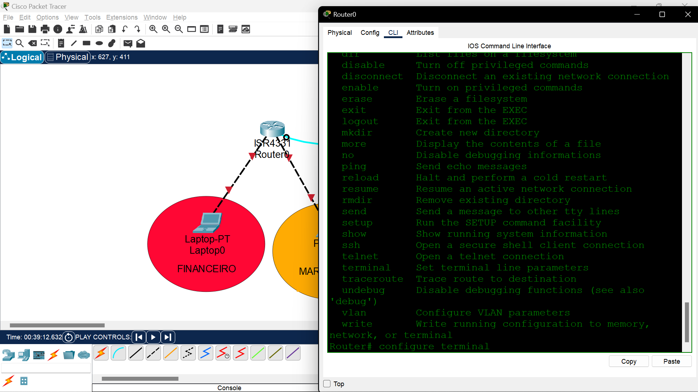
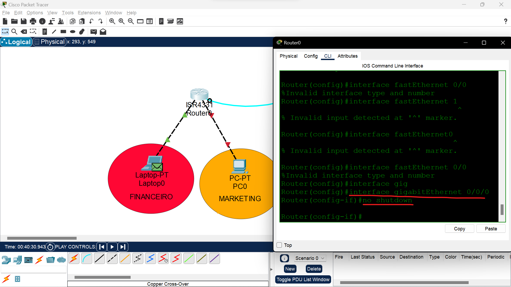
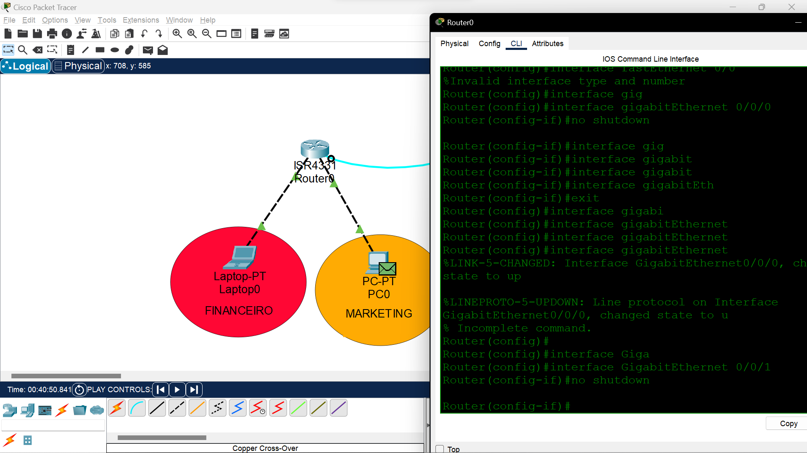
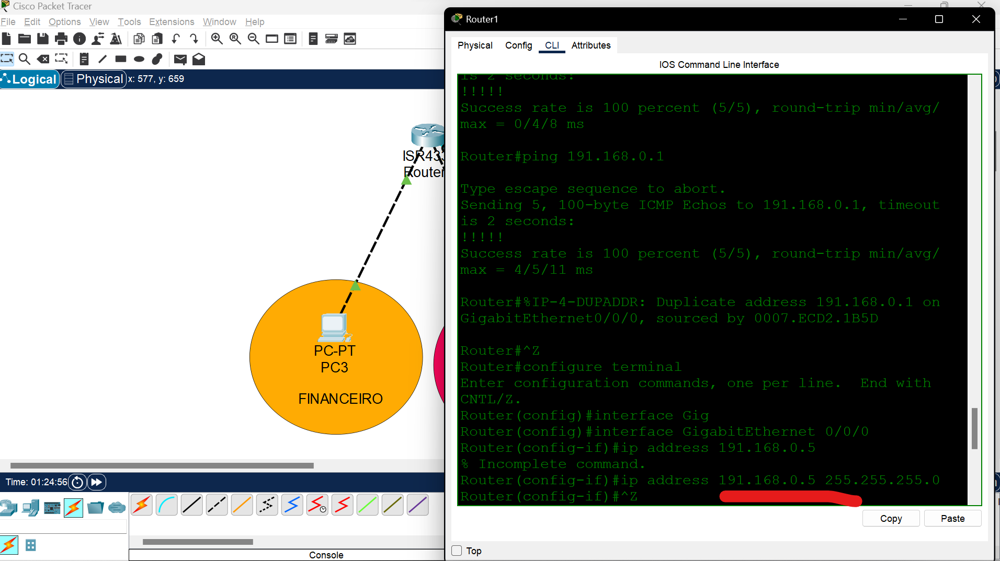
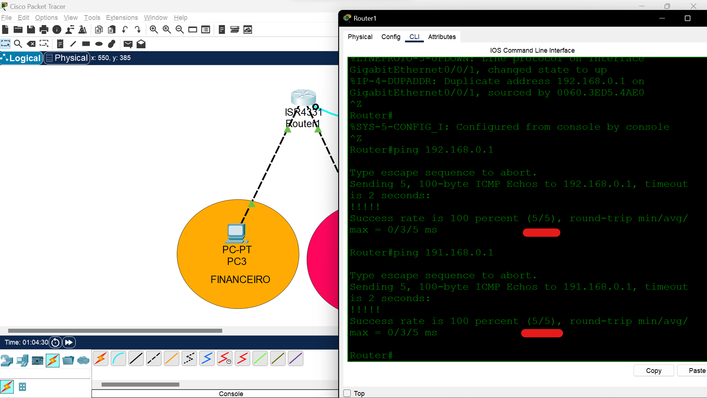
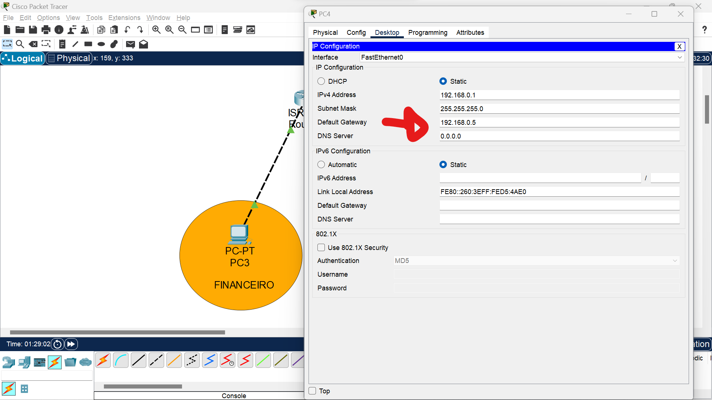
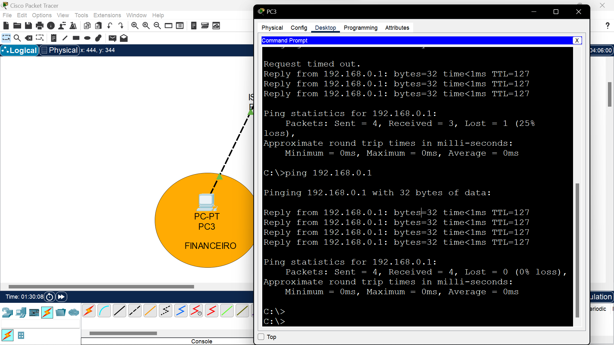

# **Endereçamento IP**

O **IP** é uma forma de uma máquina se identificar na rede, é uma identidade.

## **Servidor DNS** 
É o responsável por traduzir o link de um servidor em um IP, exemplo, quando pingamos o *www.google.com*, na verdade pingamos um IP como *2800:3f0:4001:831::2004*, quem faz essa tradução é o servidor DNS.

## **Ping**

 O **Ping** é feito pelo protocolo **ICMP (Internet Control Message Protocol)**. Uma informação importante sobre o ping é a sigla TTL (time to live), o valor apresentado por essa sigla significa por quantas máquinas (hops) nossa informação pode passar para chegar no destino final, ne **internet**, por exemplo, nosso ping não vai diretamente para a máquina em que o google fica hospedado, e sim por diversas outras que ficam no caminho.

 ## **Tracerout**
 Para ver o *tracerout* da nossa máquina até outro ip, basta usar o comando **tracert** e a url/ip em seguida:

 

 No caso das máquinas 2,6 e 8 tomamos timeout, isso pode acontecer se o provedor desabilitar a resposta para requisições **ICMP**, isso porque é assim que começam ataques **DDOS**e outros tipos de tentativas de invasão.

 para testar nossa placa de rede com testes internos, ou *loopback*, basta dar um ping em um ip reservado que começa com 127, por exemplo:
 ```CMD
 ping 127.0.0.1
 ```

 O **DNS** padrão da nossa máquina chama nosso IP de Localhost, mas isso pode ser alterado na pasta /hosts lá na C:\Windows\System32\drivers\etc do windows.

 no MAC:

```CMD
sudo vi /private/etc/hosts
```
Linux:
```CMD
sudo vi /etc/hosts
```

**nslookup:** "O Nslookup pode ser usado para descobrirmos o endereço IP de um domínio, bem como saber detalhes mais avançados de DNS, para saber se nosso serviço está sendo direcionado para a máquina de destino, por exemplo."

> Comando para verificar o ip de um domínio, mais ou menos isso.

**Hub:** Equipamento utilizado para conectar vários computadores.

# **Tipos de cabos**

Quando compramos um cabo de internet, geralmente ele vem de um lado com os fios soltos e do outro conectado a um objeto de plástico chamado **RJ45**, o processo de inserir os fios soltos ao **RJ45** chamasse **crimpar**.

## **Tipos de conexões**:

Começando pelo cabo direto:


No cabo direto, a conexão é feita com a seguinte sequência de cores:
```
- Branco do verde;
- Verde;
- Branco do laranja;
- Azul;
- Branco do azul;
- Laranja;
- Branco do marrom;
- Marrom.
```

Essa ordem de cores é no padrão **T568A**.

Observe na imagem, os dados saem do computador pelo primeiro e segundo fio e chegam pelo terceiro e sexto fio, já no hub, essa transmissão de dados é feita de forma contrária.

Agora, quando precisamos conectar um computador no outro através de um cabo de rede, o que acontece? bom, como a placa de rede de ambos computadores segue o padrão do **T568A**, quando um computador tentar enviar um dado para o outro nos fios 1 e 2, o outro computador não vai ser capaz de recebe-los, dado que sua placa de rede funciona da mesma forma, usando os fios 1 e 2 somente para envio de dados, é ai que entra um outro padrão de cores, chamado **T568B**, porém , essa sequência de cores é seguida em somente um dos lados do cabo.

a sequencia de cores do **T568B** é a seguinte:
```
- Branco do laranja;
- Laranja;
- Branco do verde;
- Azul;
- Branco do azul;
- Verde;
- Branco do marrom;
- Marrom.
```

Essa conexão chamasse **Crossover**


Hoje em dia, algumas placas de rede possuem o padrão auto-MDIX, conseguindo detectar os fios nas posições incorretas, corrigindo isso via software, é por isso que, as vezes, conseguimos conectar dois computadores através de um cabo direto.

# Cisco Packet Tracer

É um software de simulação de rede, faremos o download para começarmos os estudos.

Essa é a cara do software atualmente:


## **Iniciando um projeto no cisco**

Primeiro, faremos um projeto simples, conectando 3 máquinas a um hub e configurando um *static ip* para cada uma delas, a conexão e feita através de um cabo direto.


Para uma melhor rastreabilidade dos dados, é bom ativar a opção *simulation* ao invés de *realtime* no software.


## **Pingando instancias**


Ao enviar o ping de uma máquina para outra, é possível rastrear o envio de pacotes na aba a direita, nesse caso, tentamos pingar o **computador 2** pelo prompt do **computador 1**


Observe o comportamento do pacote, primeiro ele é enviado do **computador um** para o **hub**, em seguida, o hub envia para todas as máquinas para saber quem é a instância com o **IP** informado, após isso, o computador respectivo responde a requisição ao hub, que por sua vez retorna ao computador 1.


> O pacote também foi "enviado" para o computador 3, isso é uma limitação do hub, ele não consegue aprender onde o nosso computador está conectado, então ele envia para todos os dispositivos da rede, isso se chama **Broadcast**.

A limitação do HUB também se dá a segurança da informação, uma vez que ele envia dados para todos os usuários conectados na rede, uma pessoa má intencionada consegue capturar essa informação através de uma análise de protocolos.


# **Wireshark**
Software para monitorar o tráfego na rede, um dos programas que uma pessoa má intencionada usa para ficar te monitorando, tem um tutorial no [youtube](https://www.youtube.com/watch?v=K7xPlwpGAYE&ab_channel=InvalidEntry) que ensina a fazer isso com SSH, ou seja, você monitora o tráfego de uma placa de rede de outra pessoa remotamente:

Ao entrar no programa, é possível ver todas as placas de redes do seu computador, seja ela física ou virtual. clicando em uma delas, é possível ver o tráfego da rede.

**Não vou inserir o print pra não vazar nada, não sou besssssta.**

Conseguimos filtrar as requisições pelo IP, basta ir no prompt de comando e dar um **nslookup** no site que queremos o IP e digitar ***ip.addr = ip***, depois é só reconstruir o TCP clicando com o **botão direto** no pacote, clicando em **follow** e **TCP Stream**.
> Esse método só funciona em sites que não possuem criptografia! mais informações sobre como quebrar a criptografia [aqui](https://www.youtube.com/watch?v=VmlD6as7n68&ab_channel=MAT%5Cx48)

Como funciona o HTTPS? ele é uma implementação de segurança do protocolo HTTP, sua diferença é na criptografia dos dados através de uma chave pública e privada com protocolo **SSL (security Sockets Layer)** ou **TLS (Trasport Layer Security)**. É fornecida uma criptografia de chave pública onde só quem tem a chave privada consegue ter acesso a informação.


# Switches
A grande diferença dos switches para os hubs é que os switches armazena a localização de cada computador através do endereço MAC da sua placa de rede, isso evita o problema de Broadcast que os hubs tem, vejamos:


Ao analisar a requisição de protocolo **ARP**, vemos que o switch armazena o MAC da placa de rede que fez a requisição, podemos confirmar essa informação graças a aba a direita que mostra *MAC Address* do *Laptop0*, então quando o ping retornar do IP requisitado, o switch direcionará direto para a máquina que requisitou esse *echo* através do protocolo *ICMP*.

Vamos ver o comportamento da primeira requisição no gif abaixo:
```
Podemos ver que na primeira vez o dado trafega entre as máquinas a fim de descobri onde está o IP solicitado.
```

```
Uma vez descoberto, o switch guarda a porte em que se encontra o IP solicitado e guarda essa conexão para futuras requisições.
```


 Apesar dos switches terem resolvido o problema do broadcast, ainda é possível fazer com que o trafego de dados ocorra "descontrolavelmente" pela rede, basta sobrecarregar o armazenamento do switch enviando vários endereços MACs falsos, para resolver isso, os switches podem ser configurados para restringir o acesso as portas para determinados MACs, desabilitando-as sempre que um novo MAC for detectado.

 >O **ARP** é o protocolo utilizado para fazer o mapeamento entre o endereço IP e o endereço MAC de um dispositivo. Isso é necessário porque o MAC encontra-se um nível abaixo do IP e eu preciso dele para poder transmitir as informações.

 # **Máscara de rede**
 As máscaras de rede servem para "informar os requisitos para um computador estar na mesma rede que o outro", exemplo, uma máscara de rede **255.255.255.0** informa que os 3 primeiros conjuntos de números em um IP devem ser igual para que haja uma comunicação entre as máquinas, seguindo esse exemplo, um computador de ip **192.168.0.1** pode trocar dados com um computador de ip **192.168.0.2**, mas não com um computador de ip **191.168.0.1**, pois o primeiro conjunto de números está diferente dos outros.

 Esse **255** refere-se à rede, enquanto o 0 refere-se à máquina/hosts.

O nome de cada grupo de números é Octeto.

 > **Máscara de rede** tem como função dividir o endereço IP em dois grupos (rede e máquina) e a partir daí poder definir quando outro dispositivo estará na mesma rede que eu.

 # Roteador
 Feito para conectar uma rede a outra rede.

 #### **Como saber se precisamos de um cabo direto ou de um crossover?**
 Para responder essa pergunta, fazemos outras perguntas:
 
 1 - Os aparelhos são iguais? Não: Cabo cruzado/crossover.
 
 2 - Essa conexão vai explorar a totalidade máxima natural que o equipamento foi projetado para fazer? Não: Cabo cruzado/crossover.

Por exemplo ao interconectar o computador ao hub e o computador ao switch, o computador foi feito para se comunicar com várias máquinas e o hub e switch foram feitos para interconectar diversas máquinas. Dessa forma ao conectarmos os dois, vamos estar explorando o que os dois foram fabricados para fazer naturalmente. Porém o roteador foi feito para interconectar redes, se eu coloco somente um dispositivo, não terei como inserir outros dispositivos para o roteador encaminhar os pacotes e então a totalidade de sua função não está sendo explora. Devemos usar cabo crossover.

### Configurando o roteador
Hoje em dia, os equipamentos roteadores que temos em casa já vem com um switch embutido, mas como o software é mais para o ramo empresarial, essa junção não existe, então os dois equipamentos são segmentados.

Para que essa configuração seja feita, primeiro precisamos de uma máquina e um cabo console, cabo esse que antigamente era uma ponta RJ45 e outra ponta chamada RS232, mas essa porta já foi substituída por um USB.


Para fazer a configuração, precisamos de um programa terminal, um dos mais usados chama-se putty.

Nesse exercício, montamos um cenário hipotético onde o departamento do financeiro, ip 191.168.0.1, precisa se comunicar com o setor do marketing, ip 192.168.0.1, mas ambos os setores estão em redes distintas, faremos essa ligação através de um roteador.

Se observar-mos a imagem, é possível ver que as portas do roteador vem desligadas por padrão, primeiro passo é ativa-las.

Primeiro, precisamos acessar o roteador pelo terminal da máquina e entrar em modo root, no software da cisco, basta escrever **enable**.

Para entrar na aba de configurações, basta digitar **configure terminal** no terminal:



Nesse caso, a porta do nosso roteador chama-se **interface gigabitEthernet 0/0/0**, então é ela que temos que ativar com o comando **no shutdown**, a mesma coisa com a segunda porta, segue os comandos:

```CMD
    enable
    config terminal
    interface gigabitEthernet 0/0/0
    no shutdown
```

saída:

```CMD
Router(config)#interface gigabitEthernet 0/0/0
Router(config-if)#no shutdown

Router(config-if)#interface fastEthernet 0/0
```





Próximo passo é configurar o IP, começando pela segunda máquina.

Pelo prompt, conseguimos ver que, parar "cadastrar" uma máquina na rede, precisamos da-lá um IP e informar a máscara de rede na qual ela pertence, lembrando que para as máquinas pertencerem a mesma rede, devem compartilhar a mesma máscara, o IP informado aqui não é o da máquina, e sim o IP da porta do roteador que a máquina está conectada.

```CMD
    ip address 191.168.0.5 255.255.255.0
```



A segunda máquina está em uma rede diferente, lembramos que seu ip é **191.168.0.1**.

```CMD
    ip address 192.168.0.5 255.255.255.0
```

Podemos ver que, se feito corretamente, o roteador vai conseguir pingar as duas máquinas, mas ambas não vão poder mandar requisições ICMP entre sí.



Mas por que não conseguimos trafegar dados entre as máquinas diretamente? um fator muito importante que impede isso é a diferença entre o primeiro octeto de ambos os IPs, vejamos.
```CMD
ips - 
191.168.0.1
192.168.0.1
máscara de rede - 
255.255.255.0
```

A máscara de rede exige que, para dois computadores se comunicarem na mesma rede, o padrão dos octetos devem ser o mesmo, com exceção, nesse caso, do último octeto.

Para resolver esse problema, usamos algo chamado **Default Gateway** ou *Portão Padrão*, nós configuramos isso nas máquinas, apontando para qual vai ser o portão padrão de saída dos dados. Nesse campo, colocamos o IP que nós demos para a porta do roteador referente a onde cada máquina está conectada, como descrito abaixo:

```CMD
    191.168.0.1 -> 191.168.0.5
    192.168.0.1 -> 192.168.0.5
```


Só assim conseguimos trafegar informação entre as duas máquinas:



## **Resumindo**

Quando temos redes diferentes, utilizamos o **default gateway** do roteador para fazer essa intermediação entre os dois comutadores.

## **Como acessar o roteador da nossa casa?**
Simples, basta saber qual é o nosso **default gateway** pelo *ifconfig* no prompt de comando e jogar esse ip lá no google!