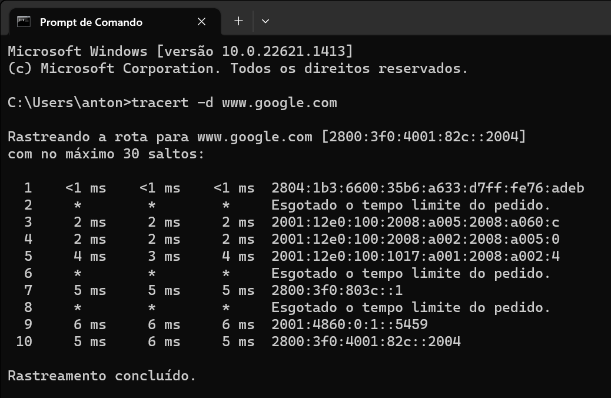
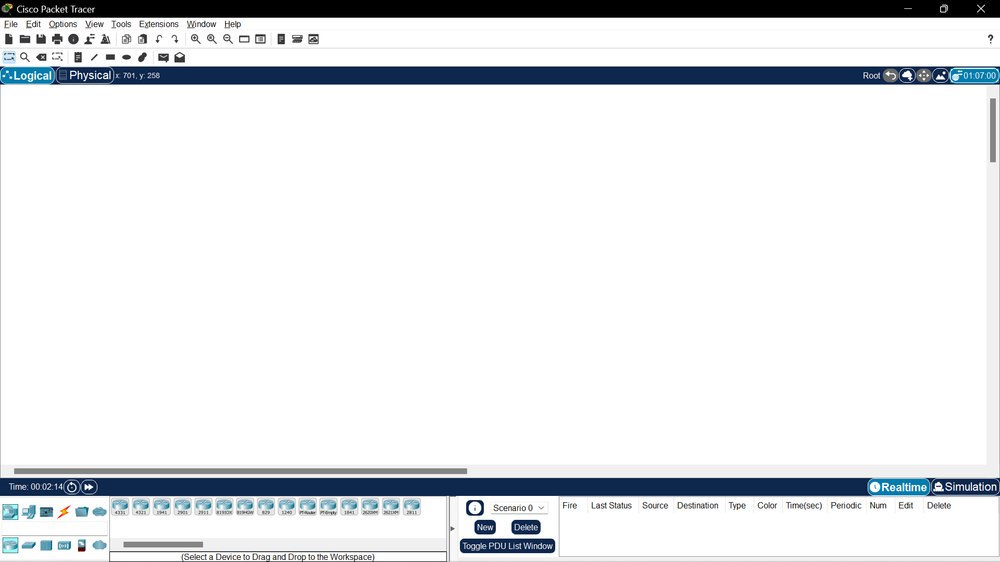
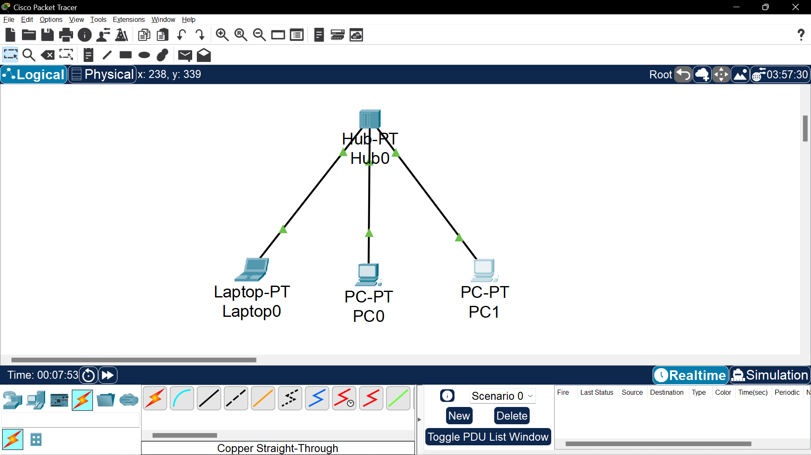
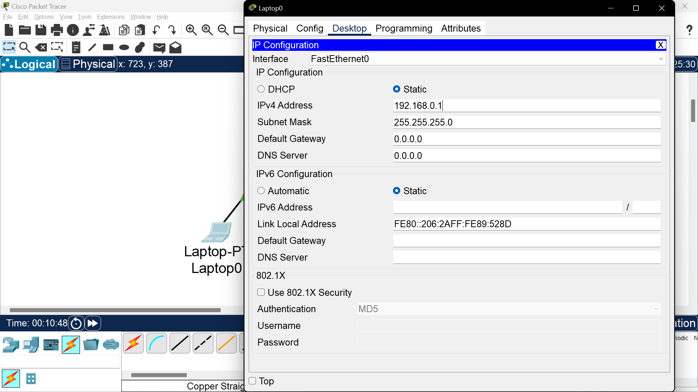
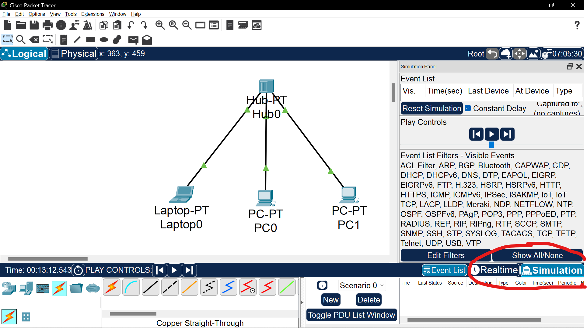
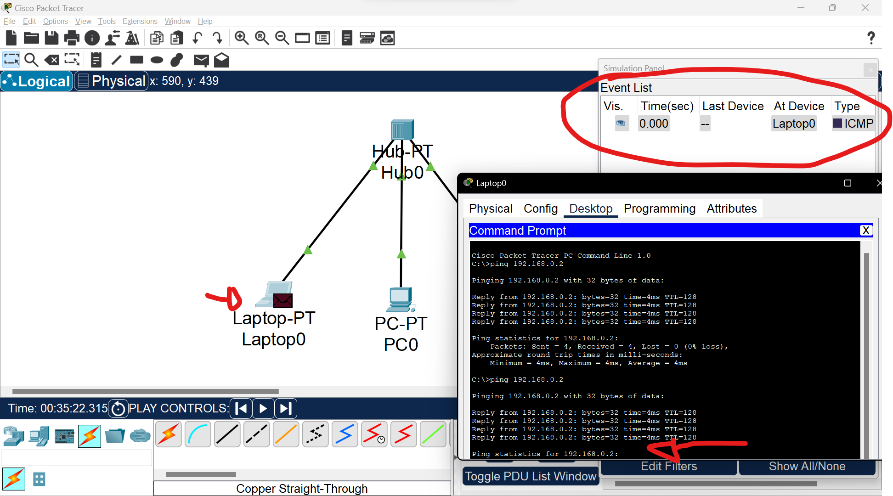
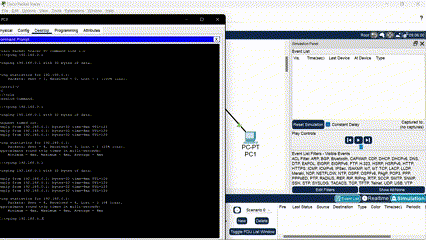

# **Endereçamento IP**

O **IP** é uma forma de uma máquina se identificar na rede, é uma identidade.

## **Servidor DNS** 
É o responsável por traduzir o link de um servidor em um IP, exemplo, quando pingamos o *www.google.com*, na verdade pingamos um IP como *2800:3f0:4001:831::2004*, quem faz essa tradução é o servidor DNS.

## **Ping**

 O **Ping** é feito pelo protocolo **ICMP (Internet Control Message Protocol)**. Uma informação importante sobre o ping é a sigla TTL (time to live), o valor apresentado por essa sigla significa por quantas máquinas (hops) nossa informação pode passar para chegar no destino final, ne **internet**, por exemplo, nosso ping não vai diretamente para a máquina em que o google fica hospedado, e sim por diversas outras que ficam no caminho.

 ## **Tracerout**
 Para ver o *tracerout* da nossa máquina até outro ip, basta usar o comando **tracert** e a url/ip em seguida:

 

 No caso das máquinas 2,6 e 8 tomamos timeout, isso pode acontecer se o provedor desabilitar a resposta para requisições **ICMP**, isso porque é assim que começam ataques **DDOS**e outros tipos de tentativas de invasão.

 para testar nossa placa de rede com testes internos, ou *loopback*, basta dar um ping em um ip reservado que começa com 127, por exemplo:
 ```CMD
 ping 127.0.0.1
 ```

 O **DNS** padrão da nossa máquina chama nosso IP de Localhost, mas isso pode ser alterado na pasta /hosts lá na C:\Windows\System32\drivers\etc do windows.

 no MAC:

```CMD
sudo vi /private/etc/hosts
```
Linux:
```CMD
sudo vi /etc/hosts
```

**nslookup:** "O Nslookup pode ser usado para descobrirmos o endereço IP de um domínio, bem como saber detalhes mais avançados de DNS, para saber se nosso serviço está sendo direcionado para a máquina de destino, por exemplo."

> Comando para verificar o ip de um domínio, mais ou menos isso.

**Hub:** Equipamento utilizado para conectar vários computadores.

# **Tipos de cabos**

Quando compramos um cabo de internet, geralmente ele vem de um lado com os fios soltos e do outro conectado a um objeto de plástico chamado **RJ45**, o processo de inserir os fios soltos ao **RJ45** chamasse **crimpar**.

## **Tipos de conexões**:

Começando pelo cabo direto:


No cabo direto, a conexão é feita com a seguinte sequência de cores:
```
- Branco do verde;
- Verde;
- Branco do laranja;
- Azul;
- Branco do azul;
- Laranja;
- Branco do marrom;
- Marrom.
```

Essa ordem de cores é no padrão **T568A**.

Observe na imagem, os dados saem do computador pelo primeiro e segundo fio e chegam pelo terceiro e sexto fio, já no hub, essa transmissão de dados é feita de forma contrária.

Agora, quando precisamos conectar um computador no outro através de um cabo de rede, o que acontece? bom, como a placa de rede de ambos computadores segue o padrão do **T568A**, quando um computador tentar enviar um dado para o outro nos fios 1 e 2, o outro computador não vai ser capaz de recebe-los, dado que sua placa de rede funciona da mesma forma, usando os fios 1 e 2 somente para envio de dados, é ai que entra um outro padrão de cores, chamado **T568B**, porém , essa sequência de cores é seguida em somente um dos lados do cabo.

a sequencia de cores do **T568B** é a seguinte:
```
- Branco do laranja;
- Laranja;
- Branco do verde;
- Azul;
- Branco do azul;
- Verde;
- Branco do marrom;
- Marrom.
```

Essa conexão chamasse **Crossover**


Hoje em dia, algumas placas de rede possuem o padrão auto-MDIX, conseguindo detectar os fios nas posições incorretas, corrigindo isso via software, é por isso que, as vezes, conseguimos conectar dois computadores através de um cabo direto.

# Cisco Packet Tracer

É um software de simulação de rede, faremos o download para começarmos os estudos.

Essa é a cara do software atualmente:



## **Iniciando um projeto no cisco**

Primeiro, faremos um projeto simples, conectando 3 máquinas a um hub e configurando um *static ip* para cada uma delas, a conexão e feita através de um cabo direto.





Para uma melhor rastreabilidade dos dados, é bom ativar a opção *simulation* ao invés de *realtime* no software.



## **Pingando instancias**


Ao enviar o ping de uma máquina para outra, é possível rastrear o envio de pacotes na aba a direita, nesse caso, tentamos pingar o **computador 2** pelo prompt do **computador 1**


Observe o comportamento do pacote, primeiro ele é enviado do **computador um** para o **hub**, em seguida, o hub envia para todas as máquinas para saber quem é a instância com o **IP** informado, após isso, o computador respectivo responde a requisição ao hub, que por sua vez retorna ao computador 1.


> O pacote também foi "enviado" para o computador 3, isso é uma limitação do hub, ele não consegue aprender onde o nosso computador está conectado, então ele envia para todos os dispositivos da rede, isso se chama **Broadcast**.

A limitação do HUB também se dá a segurança da informação, uma vez que ele envia dados para todos os usuários conectados na rede, uma pessoa má intencionada consegue capturar essa informação através de uma análise de protocolos.


# **Wireshark**
Software para monitorar o tráfego na rede, um dos programas que uma pessoa má intencionada usa para ficar te monitorando, tem um tutorial no [youtube](https://www.youtube.com/watch?v=K7xPlwpGAYE&ab_channel=InvalidEntry) que ensina a fazer isso com SSH, ou seja, você monitora o tráfego de uma placa de rede de outra pessoa remotamente:

Ao entrar no programa, é possível ver todas as placas de redes do seu computador, seja ela física ou virtual. clicando em uma delas, é possível ver o tráfego da rede.

**Não vou inserir o print pra não vazar nada, não sou besssssta.**

Conseguimos filtrar as requisições pelo IP, basta ir no prompt de comando e dar um **nslookup** no site que queremos o IP e digitar ***ip.addr = ip***, depois é só reconstruir o TCP clicando com o **botão direto** no pacote, clicando em **follow** e **TCP Stream**.
> Esse método só funciona em sites que não possuem criptografia! mais informações sobre como quebrar a criptografia [aqui](https://www.youtube.com/watch?v=VmlD6as7n68&ab_channel=MAT%5Cx48)

Como funciona o HTTPS? ele é uma implementação de segurança do protocolo HTTP, sua diferença é na criptografia dos dados através de uma chave pública e privada com protocolo **SSL (security Sockets Layer)** ou **TLS (Trasport Layer Security)**. É fornecida uma criptografia de chave pública onde só quem tem a chave privada consegue ter acesso a informação.


# Switches
A grande diferença dos switches para os hubs é que os switches armazena a localização de cada computador através do endereço MAC da sua placa de rede, isso evita o problema de Broadcast que os hubs tem, vejamos:


Ao analisar a requisição de protocolo **ARP**, vemos que o switch armazena o MAC da placa de rede que fez a requisição, podemos confirmar essa informação graças a aba a direita que mostra *MAC Address* do *Laptop0*, então quando o ping retornar do IP requisitado, o switch direcionará direto para a máquina que requisitou esse *echo* através do protocolo *ICMP*.

Vamos ver o comportamento da primeira requisição no gif abaixo:
```
Podemos ver que na primeira vez o dado trafega entre as máquinas a fim de descobri onde está o IP solicitado.
```

```
Uma vez descoberto, o switch guarda a porte em que se encontra o IP solicitado e guarda essa conexão para futuras requisições.
```

 Apesar dos switches terem resolvido o problema do broadcast, ainda é possível fazer com que o trafego de dados ocorra "descontrolavelmente" pela rede, basta sobrecarregar o armazenamento do switch enviando vários endereços MACs falsos, para resolver isso, os switches podem ser configurados para restringir o acesso as portas para determinados MACs, desabilitando-as sempre que um novo MAC for detectado.

 >O **ARP** é o protocolo utilizado para fazer o mapeamento entre o endereço IP e o endereço MAC de um dispositivo. Isso é necessário porque o MAC encontra-se um nível abaixo do IP e eu preciso dele para poder transmitir as informações.